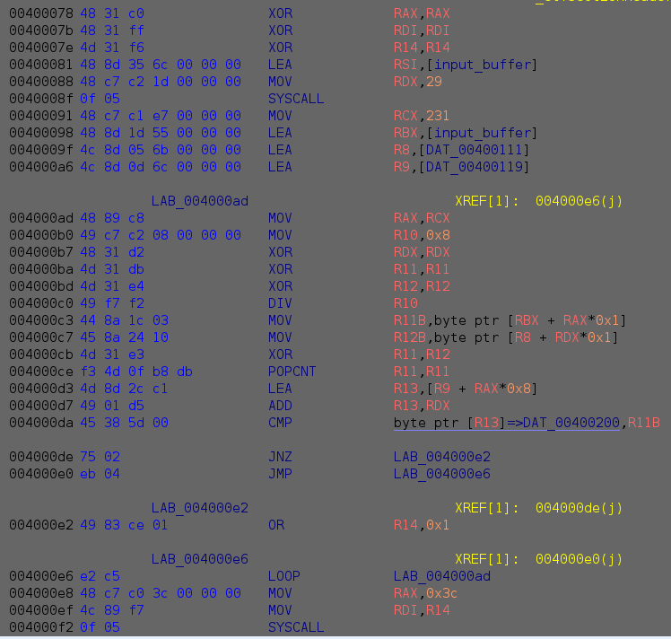

# Barbhack 2020 - reverse - 100 points
This challenge was called *smaller_than_ever* 
This is a ELF 64-bit LSB executable, asking for a user entry and exit.
Let's give it to ghidra (I already renamed the input buffer):



- `RCX` is initialized to 231,
- `RBX` get the address of the input buffer,
- `R8` get the address of a table (let's call it `table1` for now),
- `R9` get the address of a table (let's call it `table2` for now).

```
main loop:
	MOV  RAX,RCX
	MOV  R10,0x8
	XOR  RDX,RDX
	XOR  R11,R11
	XOR  R12,R12
	DIV  R10
	MOV  R11B,byte ptr [RBX + RAX*0x1]
	MOV  R12B,byte ptr [R8 + RDX*0x1]
```
In this first part of the loop, `RCX` is divided by 8. The result (quotient) goes in `RAX` (28) and remainder goes to `RDX` (7).

Then in `R11` we get the last byte of our input (minus one, which is '\n'), and `R12` gets the last byte of table1.
```
	XOR     R11,R12
	POPCNT  R11,R11
```
The last byte of the input is then xored with the last byte of `table1`. `POPCNT` returns the count of number of bits sets to one in the result of the previous `XOR` 
This number of bits sets is compared to the last byte of `table2`:
```
	LEA     R13,[R9 + RAX*0x8]
	ADD     R13,RDX
	CMP     byte ptr [R13]=>DAT_00400200,R11B
```
If the comparaison fails, return value is set to `1`.
```
                JNZ             return_error
                JMP             result_ok
return_error:
                OR              R14,0x1
result_ok:
                LOOP            main_loop
                MOV             RAX,0x3c
                MOV             RDI,R14
                SYSCALL
```
`LOOP` instruction decrements `RCX` before it jumps. 
In other words, for each input characters, starting from the end, the program do a xor with this value and each of the 8 values in `table1` and compare the counts of bits equal to `1` in the result with each of the corrresponding value in `table2`.

We can now write a python program to find the flag:
```python
import string

flag = ""

mask  = [0xC0, 0x03, 0x18, 0x60, 0x06, 0x81, 0x30, 0x0C]
count = [3, 3, 5, 1, 3, 5, 3, 5, 4, 4, 4, 2, 4, 6, 2, 6, 3, 3, 5, 1, 3, 5, 3, 5,
          6, 4, 4, 4, 6, 6, 4, 6, 3, 5, 3, 1, 5, 5, 1, 5, 4, 4, 2, 2, 4, 4, 0, 4,
          3, 5, 3, 1, 5, 5, 1, 5, 4, 2, 6, 2, 4, 4, 4, 6, 4, 4, 2, 2, 4, 4, 0, 4,
          5, 5, 5, 3, 5, 5, 3, 5, 5, 5, 5, 3, 3, 7, 5, 3, 4, 6, 4, 2, 4, 6, 2, 4,
          4, 4, 4, 2, 6, 4, 4, 4, 5, 5, 5, 3, 3, 7, 5, 3, 5, 3, 7, 3, 3, 5, 5, 5,
          6, 4, 4, 6, 4, 6, 6, 4, 5, 5, 3, 3, 3, 5, 1, 3, 4, 6, 4, 2, 4, 6, 4, 2,
          4, 6, 4, 2, 4, 6, 4, 2, 6, 4, 4, 6, 4, 6, 6, 4, 4, 6, 4, 2, 4, 6, 2, 4,
          3, 5, 3, 1, 5, 5, 3, 3, 6, 2, 4, 4, 4, 4, 2, 6, 6, 4, 4, 6, 4, 6, 6, 4,
          6, 4, 6, 4, 4, 6, 4, 6, 5, 5, 3, 3, 3, 5, 1, 3, 5, 5, 3, 3, 7, 5, 3, 5,
          6, 6, 4, 4, 6, 6, 4, 4, 4, 2, 2, 4, 2, 4, 4, 2]

count_offset = 28 * 8

for _ in range(29):
    for c in string.printable:
        found = True
        for index in range (7, -1, -1):
            xor = ord(c) ^ mask[index];
            ones = bin(xor).count("1")
            if ones != count[count_offset + index]:
                found = False
                break

        if found:
            flag += c
            break

    count_offset -= 8


print(flag[::-1])
```
Flag:
```	
	brb{p0pc0unting_4ll_th3_w4y}
```
	


